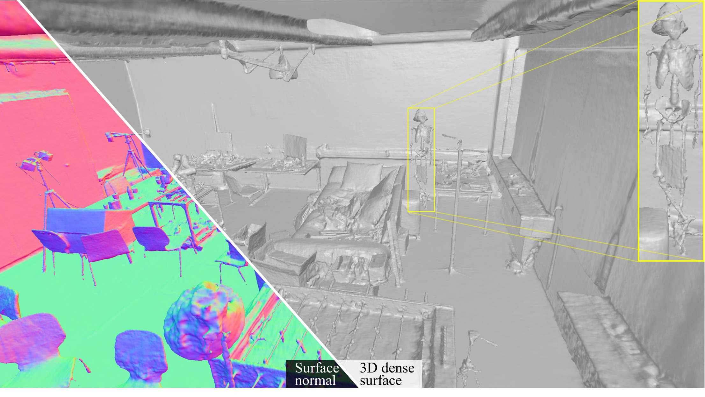

# ND-SDF
ND-SDF: Learning Normal Deflection Fields for High-Fidelity Indoor Reconstruction
### [Project Page](https://zju3dv.github.io/nd-sdf/) | [Paper](https://www.arxiv.org/abs/2408.12598)
<br/>

> ND-SDF: Learning Normal Deflection Fields for High-Fidelity Indoor Reconstruction

> Ziyu Tang, [Weicai Ye](https://ywcmaike.github.io/), Yifan Wang, Di Huang, Hujun Bao, Tong He, Guofeng Zhang

> ICLR 2025, Spotlight



## Demo

https://zju3dv.github.io/nd-sdf/static/videos/e0_notop_rgb.mp4

See more results on the [project page](https://zju3dv.github.io/nd-sdf/).

## Installation
Clone this repository:
```bash
git clone https://github.com/zju3dv/ND-SDF.git
cd ND-SDF
```
Create a new conda environment:
```bash
conda create -n ndsdf python=3.8
conda activate ndsdf
```
Install pytorch and other dependencies:
```bash
pip install torch==1.12.1+cu113 torchvision==0.13.1+cu113 torchaudio==0.12.1 -f https://download.pytorch.org/whl/torch_stable.html
pip install -r requirements.txt
```

TODO List:
- [ ] Light training config (512 or 1024 rays per batch): We do not use mlp for scene representation, since it inherently causes detail loss in complex scenes. With hashgrid as the scene primitive, we adopt sampling 4×1024 rays per batch as it's more stable especially when training on ScanNet, which suffers from motion blur heavily.
## Dataset
Our code is compatible with the data format of MonoSDF. We thank monosdf for providing the following indoor datasets: [ScanNet](https://s3.eu-central-1.amazonaws.com/avg-projects/monosdf/data/scannet.tar), [replica](https://s3.eu-central-1.amazonaws.com/avg-projects/monosdf/data/Replica.tar), and [Tanksandtemples](https://s3.eu-central-1.amazonaws.com/avg-projects/monosdf/data/tnt_advanced.tar). Click the blue hyperlinks to download the datasets with processed priors. After downloading, extract the files to the `data` folder in the root directory.

The data structure should look like this:
```
ND-SDF
├── data
│   ├── scannet
│   │   ├── scan1
│   │   ├── ...
│   ├── replica
│   │   ├── scan1
│   │   ├── ...
│   ├── ...
```

- We provide three preprocessed scenes from [ScanNet++](https://drive.google.com/file/d/13yIvSndiOT3XhDrAbpY2dIQSo1Qja08s/view?usp=drive_link) with incorporated monocular priors. For the full dataset, please refer to Wang's [NeuRodin](https://github.com/Open3DVLab/NeuRodin) for tips on downloading and processing.

## Training
ScanNet:
```bash
torchrun --nproc_per_node=1 exp_runner.py --conf confs/scannet.yaml --scan_id 1
```
Replica:
```bash
torchrun --nproc_per_node=1 exp_runner.py --conf confs/replica.yaml --scan_id 1
```
Tanksandtemples:
```bash
torchrun --nproc_per_node=1 exp_runner.py --conf confs/tnt.yaml --scan_id 1
```
ScanNet++:
```bash
torchrun --nproc_per_node=1 exp_runner.py --conf confs/scannetpp.yaml --scan_id 1
```

You can continue training from the latest checkpoint:
```bash
torchrun --nproc_per_node=1 exp_runner.py \
--conf <path_to_config_file> \ # e.g., runs/exp_name/timestamp/conf.yaml
--is_continue
```
Or continue training from a specific checkpoint:
```bash
torchrun --nproc_per_node=1 exp_runner.py \
--conf <path_to_config_file> \
--is_continue \
--checkpoint <path_to_checkpoint> # e.g., runs/exp_name/timestamp/checkpoints/xxx.pth
```
Our code supports multi-GPU training (DDP). You can specify the number of GPUs by `--nproc_per_node`, e.g., `torchrun --nproc_per_node=4 ...`.


## Evaluation
### Mesh Extraction

After training, you can extract the mesh by running:
```bash
python scripts/extract_mesh.py \
--conf <path_to_config_file> \
--checkpoint <path_to_checkpoint> \
--res 512 \ # marching cube resolution, we recommend 1024 or higher when evaluating large complex scenes.
--textured # optional, if you want to extract textured mesh
```

### Evaluate the Mesh

Our evaluation methods for ScanNet and Replica datasets are consistent with [DebSDF](https://github.com/DavidXu-JJ/DebSDF). We thank the authors for providing the code. Below are the evaluation scripts for intermediate extracted meshes during or after training. 

ScanNet:
```bash
cd evals/scannet_eval
python evaluate.py --exp_name <exp_name> # <exp_name> refer to the one defined in the config file
````
Replica:
```bash
cd evals/replica_eval
python evaluate.py --exp_name <exp_name>
```
ScanNet++:
```bash
cd evals/scannetpp_eval
python evaluate.py --exp_name <exp_name>
```
You can also evaluate a specific extracted mesh. Take the ScanNet dataset as an example:
```bash
cd evals/scannet_eval
python evaluate_single_mesh.py \
--mesh_dir <path_to_mesh_dir> \
--scan_id 1
```
For Tanksandtemples dataset, please refer to the [official evaluation page](https://www.tanksandtemples.org/) for details. We provide a submission example in [Submission](https://drive.google.com/file/d/1Q8-E6jwCCCg-yp3T8Ey6yD4Awr6eS9y8/view?usp=drive_link).

Tips:
- For ScanNet++ dataset, we recommend evaluating a mesh extracted at 1024/2048 resolution, as it contains more details and finer structures. First, run `scripts/extract_mesh.py` to extract the high-resolution mesh, then evaluate it by using `evals/scannetpp_eval/evaluate_single_mesh.py`.
## Run with Custom Dataset
We support converting your own COLMAP dataset to the ND-SDF format. The input data structure should look like this:
```
<custom_dataset_dir>
├── input
│   ├── 1.jpg
│   ├── ...
```
Run COLMAP on the custom dataset:
```bash
cd preprocess/datasets
python convert.py -s <custom_dataset_dir>
```
Convert the COLMAP format to the ND-SDF format:
```bash
python process_colmap_to_json.py -i <custom_dataset_dir> 
```
We provide a simple, interactive procedure to help locate the bounding box of the scene (highly recommended). Try it by adding the `--if_interactive` flag.

### Generate Monocular Cues
We provide scripts to extract monocular cues using [Omnidata](https://github.com/EPFL-VILAB/omnidata?tab=readme-ov-file).

Install:
```bash
cd preprocess/omnidata
sh download.sh
```
Then extract monocular cues:
```bash
python extract_mono_cues_square.py --input_dir <custom_dataset_dir>/rgb --output_dir <custom_dataset_dir> --task normal
```
```bash
python extract_mono_cues_square.py --input_dir <custom_dataset_dir>/rgb --output_dir <custom_dataset_dir> --task depth
```
Train on the custom dataset:
```bash
torchrun --nproc_per_node=1 exp_runner.py --conf confs/custom.yaml --scan_id -1 --data_dir <custom_dataset_dir>
```

Notes: This codebase is built from scratch and additionally features Neus as a backend, NerfAcc for acceleration fast like [instant-angelo](https://github.com/hugoycj/Instant-angelo), etc. For more details, please refer to the codebase.

## Acknowledgement

## Citation

If you find this code useful for your research, please use the following BibTeX entry.

```bibtex
@article{tang2024ndsdf,
    title={ND-SDF: Learning Normal Deflection Fields for High-Fidelity Indoor Reconstruction},
    author={Ziyu Tang and Weicai Ye and Yifan Wang and Di Huang and Hujun Bao and Tong He and Guofeng Zhang},
    booktitle=={arxiv preprint},
    year={2024}
}
```
