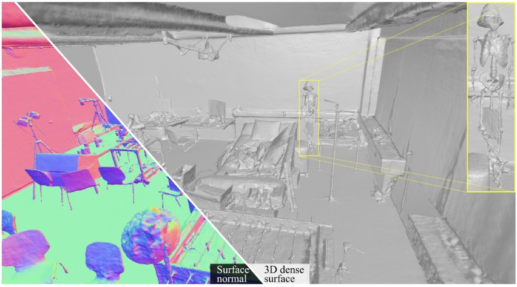

# ND-SDF
ND-SDF: Learning Normal Deflection Fields for High-Fidelity Indoor Reconstruction
### [Project Page](https://zju3dv.github.io/nd-sdf/) | [Paper]()
<!-- Code is coming soon. -->

<br/>

> ND-SDF: Learning Normal Deflection Fields for High-Fidelity Indoor Reconstruction

> Ziyu Tang, [Weicai Ye](https://ywcmaike.github.io/), Yifan Wang, Di Huang, Hujun Bao, Tong He, Guofeng Zhang





<!--  -->


## Brewing🍺, code coming soon.
## Citation

If you find this code useful for your research, please use the following BibTeX entry.

```bibtex
@article{tang2024ndsdf,
    title={ND-SDF: Learning Normal Deflection Fields for High-Fidelity Indoor Reconstruction},
    author={Ziyu Tang and Weicai Ye and Yifan Wang and Di Huang and Hujun Bao and Tong He and Guofeng Zhang},
    booktitle== {arxiv preprint},
    year={2024}
}
```